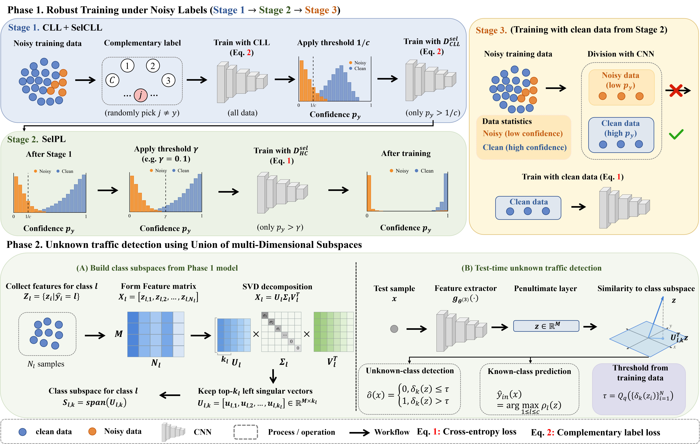

# Argus: Towards Reliable Network Intrusion Detection in Noisy and Open Environments

This repo is for **Argus** model.




## Folder Structure

```text
Argus/
├── Phase1_Training/
│   ├── Stage_1.py                      # Stage_1
│   ├── Stage_2.py                      # Stage_2
│   ├── Stage_3.py                      # Stage_3
│   ├── utils.py

├── Phase2/
│   ├── extract_features.py
│   ├── evaluate.py

├── Pipeline_Scripts/
│   ├── run_Phase_1.sh
│   └── run_Phase_2.sh
├── scis_paper.tex
└── README.md
```

## Requirements

```
torch==2.1.1
numpy==1.26.1
scikit-learn==1.7.2
pandas==2.1.3
tqdm==4.67.1
matplotlib==3.8.2
```

Full dependencies: see `requirements.txt`

## Datasets

MAL_TLS2023 dataset: https://github.com/gcx-Yuan/BoAu
TII-SSRC-23 dataset: https://www.kaggle.com/datasets/daniaherzalla/tii-ssrc-23


## Quick Start

Project root assumed:

```bash
/home/ju/Desktop/CL
```

### 1) Run Phase 1 training pipeline (Stage 1 -> Stage 2 -> Stage 3)

```bash
bash Argus/Pipeline_Scripts/run_Phase_1.sh
```

Training outputs are saved by default to:

```text
Argus/logs_csv/<dataset>/
```

Cache is saved by default to:

```text
Argus/cache/
```

### 2) Run Phase 2 unknown traffic detection (Stage_3)

```bash
bash Argus/Pipeline_Scripts/run_Phase_2.sh
```

unknown_traffic_detect outputs are saved by default to:

```text
Argus/Phase2/runs/<dataset>/
```

## Notes

- Dataset split and preprocessing rules are implemented in `Phase1_Training/utils.py`.

- You can still override paths (e.g., `CSV_PATH`, `CACHE_NPZ`, `SAVE_DIR`, `CHECKPOINT`) via environment variables.

